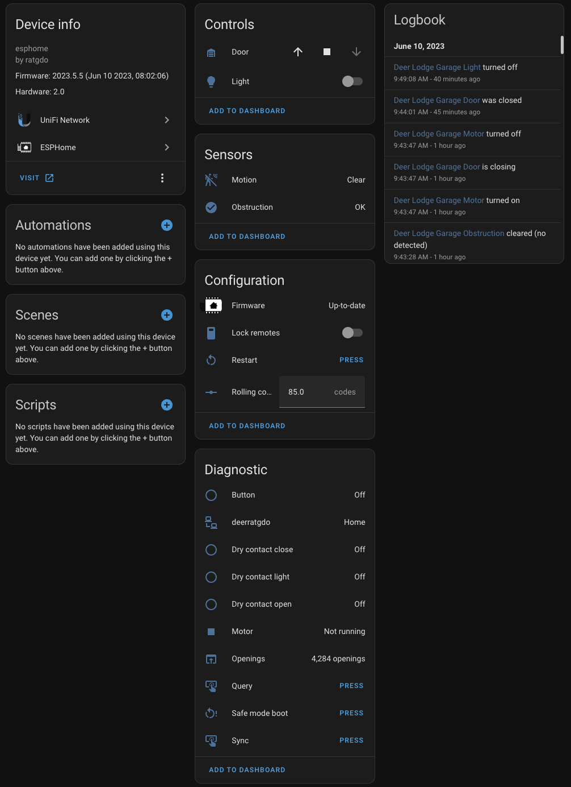

# ratgdo for ESPHome

This is a port of the ratgdo software for the v2 board to ESPHome.

[Visit the github.io page to purchase boards](https://paulwieland.github.io/ratgdo/#order)

This project is not affiliated with ratgdo or Paul Wieland. Please buy his boards to support his excellent work.

## Moving from stock ratgdo

If you have not used the stock ratgdo firmware, and are starting with a fresh install of the ESPHome based firmware, skip these steps.

- Use the [`Logs & Console`](https://paulwieland.github.io/ratgdo/flash.html) to view and make note of the current rolling code
- Flash the new ESPHome based firmware using the [Web Installer](https://esphome-ratgdo.github.io/esphome-ratgdo/)
- Use the `number` entity in Home Assistant or the built-in ESPHome web-server to set the rolling code.

# First use

The ESPHome firmware will allow you to open the door to any position after calibration. To calibrate the door, open and close it once without stopping.

## Updating from versions older than 2023.07.07

When updating from older versions, save the rolling counter value and restore it via the number entity after flashing the new firmware. If you forget to save the code, check the Home Assistant history.

# ESPHome config

- [ESPHome config for v2 board with ESP8266 D1 Mini lite](https://github.com/ESPHome-RATGDO/esphome-ratgdo/blob/main/static/v2board_esp8266_d1_mini_lite.yaml)
- [ESPHome config for v2 board with ESP32 D1 Mini](https://github.com/ESPHome-RATGDO/esphome-ratgdo/blob/main/static/v2board_esp32_d1_mini.yaml)
- [Web Installer](https://esphome-ratgdo.github.io/esphome-ratgdo/)

